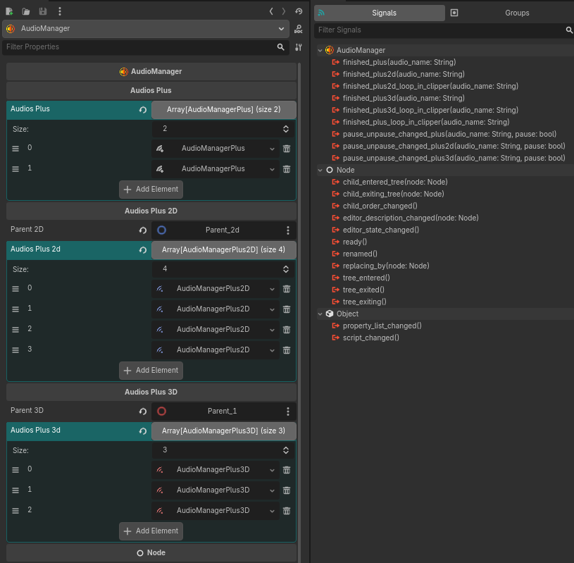
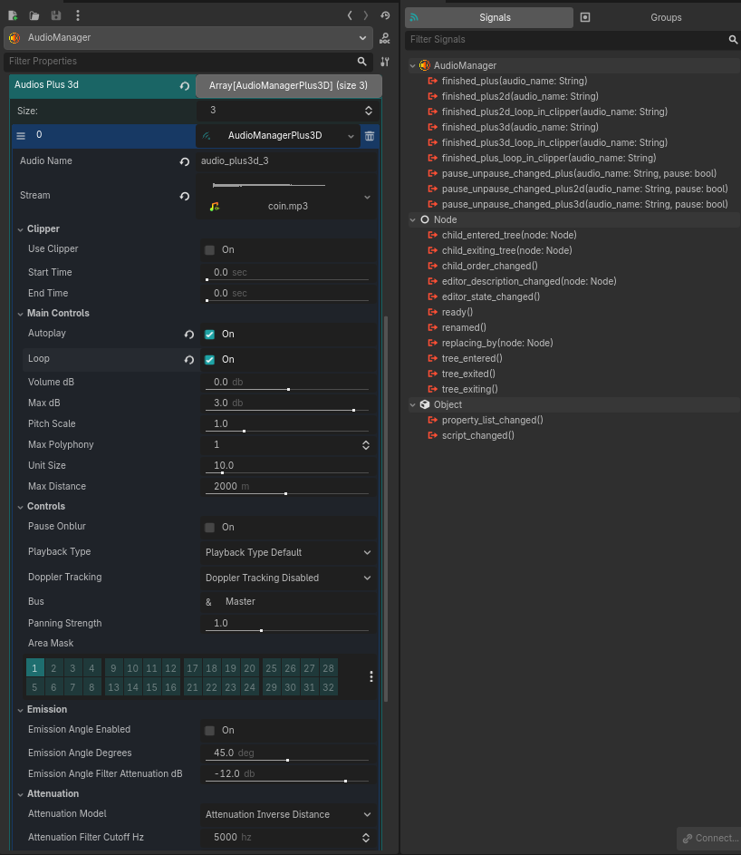
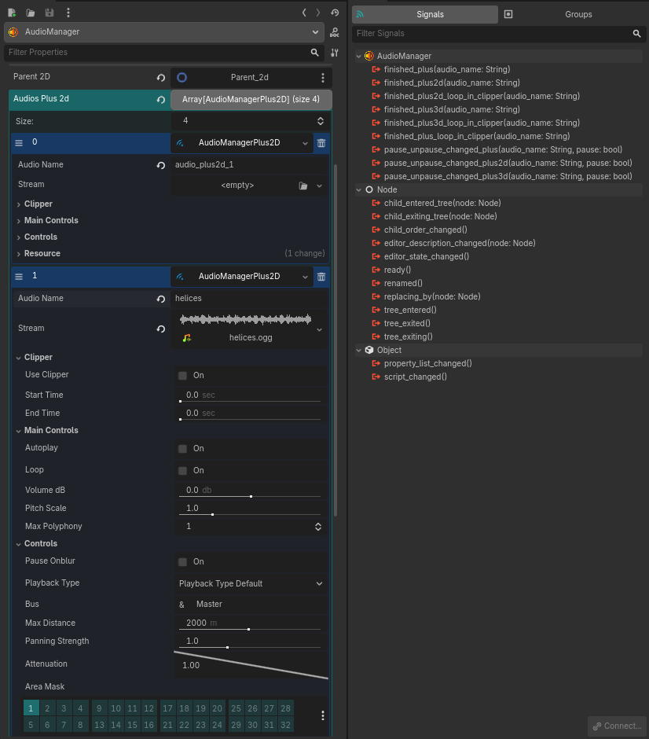
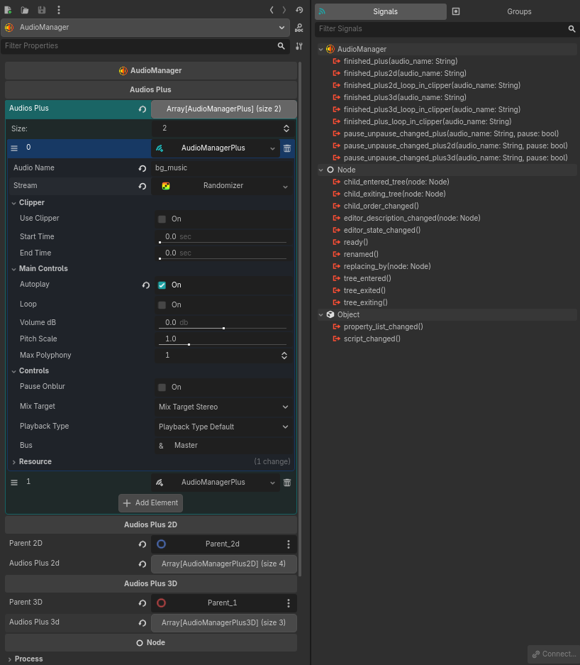

<h1 align="center">Audio Manager</h1>
<div align="center">
  
</div>
<h3 align="center">Plugin for Godot 4.5x</h3>
<hr>
<div style="max-width: 800px; margin:0px auto;">
<p>
  A comprehensive audio management solution for Godot projects that provides enhanced control over audio playback with support for 2D and 3D audio streams, clipping functionality, and advanced audio properties.
</p>

<p>
<b>Audio Manager</b> manages 3 main classes: <b>AudioMangerPlus</b>, <b>AudioMangerPlus2D</b>, and <b>AudioMangerPlus3D</b>, each representing the native Godot classes <b>AudioStreamPlayer</b>, <b>AudioStreamPlayer2D</b>, and <b>AudioStreamPlayer3D</b>, respectively.
</p>

<p>
<b>AudioMangerPlus</b> (omni, 2D, and 3D) replaces the old Audio Manager v1.x classes (<b>AudioMangerOmni</b>, <b>AudioManger2D</b>, and <b>AudioManger3D</b>). These 3 new nodes come with the package, and you can add them separately without needing AudioManager if you wish.
</p>

<p>
What <b>AudioManger</b> can do for you:
</p>

<p>
<b>1-</b> Currently, Godot's native Interactive stream does not emit a <b>finished</b> signal. With the new classes AudioStreamPlus, AudioStreamPlus2D, AudioStreamPlus3D, and AudioMangerPlus along with AudioManger, this is now possible.
</p>

<p>
<b>2-</b> Version 1.x did not have support for web games, but now it does! If you mark the audio as looping now, it will behave on the web without even having to re-import the audio as looping. In other words, now you just need to mark in the Godot inspector that you want the audio loop, and it will work for the web as well.
</p>

<p>
<b>3-</b> Due to limitations for web games, the web javascript API kills game processing when it loses focus. That is, if you navigate outside the browser tab, it causes unexpected behavior. With this in mind, this version 2x now has the pause_onblur option, which, if marked as true, pauses the audio and emits a signal.
</p>

<p>
  <b>4-</b> The plugin now has better performance. It has been completely rewritten. Therefore, use <b>Godot 4.5x</b> or higher.
</p>

<p>
 <b>5-</b> Some native Godot features lack support for pitch scale and max polyphony in some audio files with playlists and synchronized audio. If you forget this, the plugin will warn you in the console.
</p>

<p>
The <b>Audio Manager</b> inserts audio files into the parent node for omni audio files (AudioManagerPlus), and for AudioManagerPlus2D and AudioManagerPlus3D audio files, you can choose the parent of each audio group in the inspector using the <b>parent_2d</b> and <b>parent_3d</b> properties. Once these properties are defined, the 2D and 3D audio files are reparented to these nodes, allowing you to take full advantage of proximity sound effects, for example.
</p>

<p><b>Notes</b>:</p>
<p>
When using the pause_onblur mode, be aware that if you are running the game and change any properties in the inspector, the audio will pause, and you might forget about it. However, the plugin will warn you in the console that the audio has <b>paused</b>, so leave the console open so you don't forget.
</p>
</div>

<hr style="border-width:5px; margin-top:50px;margin-bottom:50px">
<h1 align="center"> Audio Manager Plus </h1>
<div align="center">

</div>
<h3 align="center">Properties</h3>
<table align="center">
  <thead>
    <tr>
      <th>Property</th>
      <th>Type</th>
      <th>Description</th>
    </tr>
  </thead>
  <tbody>
    <tr>
      <td><code>audio_name</code></td>
      <td>String</td>
      <td>Unique name for the audio file</td>
    </tr>
    <tr>
      <td><code>stream</code></td>
      <td>AudioStream</td>
      <td>Audio stream to be played</td>
    </tr>
    <tr>
      <td><code>use_clipper</code></td>
      <td>bool</td>
      <td>Enable/disable clipper functionality</td>
    </tr>
    <tr>
      <td><code>start_time</code></td>
      <td>float</td>
      <td>Start time in seconds when clipper is enabled</td>
    </tr>
    <tr>
      <td><code>end_time</code></td>
      <td>float</td>
      <td>End time in seconds when clipper is enabled</td>
    </tr>
     <tr>
      <td><code>clipper_ignore_time_scale</code></td>
      <td>bool</td>
      <td>Ignore time scaling for audio clipping</td>
    </tr>
    <tr>
      <td><code>autoplay</code></td>
      <td>bool</td>
      <td>Auto-play when entering tree</td>
    </tr>
    <tr>
      <td><code>loop</code></td>
      <td>bool</td>
      <td>Enable loop playback</td>
    </tr>
    <tr>
      <td><code>volume_db</code></td>
      <td>float</td>
      <td>Volume in decibels</td>
    </tr>
    <tr>
      <td><code>pitch_scale</code></td>
      <td>float</td>
      <td>Pitch and tempo multiplier</td>
    </tr>
    <tr>
      <td><code>max_polyphony</code></td>
      <td>int</td>
      <td>Maximum simultaneous sounds</td>
    </tr>
    <tr>
      <td><code>pause_onblur</code></td>
      <td>bool</td>
      <td>Pause on browser tab blur</td>
    </tr>
    <tr>
      <td><code>mix_target</code></td>
      <td>AudioStreamPlayer.MixTarget</td>
      <td>Audio mix target channels</td>
    </tr>
    <tr>
      <td><code>playback_type</code></td>
      <td>AudioServer.PlaybackType</td>
      <td>Playback type override</td>
    </tr>
    <tr>
      <td><code>bus</code></td>
      <td>StringName</td>
      <td>Audio bus name</td>
    </tr>
  </tbody>
</table>
<h3 align="center">Methods</h3>
<table align="center">
  <thead>
    <tr>
      <th>Method</th>
      <th>Parameters</th>
      <th>Description</th>
    </tr>
  </thead>
  <tbody>
    <tr>
      <td><code>play_plus(audio_name, from_position)</code></td>
      <td>audio_name: String, from_position: Float</td>
      <td>Play audio stream</td>
    </tr>
    <tr>
      <td><code>stop_plus(audio_name)</code></td>
      <td>audio_name: String</td>
      <td>Stop audio playback</td>
    </tr>
    <tr>
      <td><code>pause_plus(audio_name)</code></td>
      <td>audio_name: String</td>
      <td>Pause audio playback</td>
    </tr>
    <tr>
      <td><code>unpause_plus(audio_name)</code></td>
      <td>audio_name: String</td>
      <td>Resume audio playback</td>
    </tr>
    <tr>
      <td><code>add_plus(audio_name, audio_plus)</code></td>
      <td>audio_name: String, audio_plus: AudioManagerPlus</td>
      <td>Add new audio</td>
    </tr>
    <tr>
      <td><code>remove_plus(audio_name)</code></td>
      <td>audio_name: String</td>
      <td>Remove audio</td>
    </tr>
    <tr>
      <td><code>is_plus_playing(audio_name)</code></td>
      <td>audio_name: String</td>
      <td>Check if playing</td>
    </tr>
    <tr>
      <td><code>is_plus_paused(audio_name)</code></td>
      <td>audio_name: String</td>
      <td>Check if paused</td>
    </tr>
    <tr>
      <td><code>get_plus(audio_name)</code></td>
      <td>audio_name: String</td>
      <td>Get audio stream</td>
    </tr>
    <tr>
      <td><code>get_all_plus()</code></td>
      <td>-</td>
      <td>Get all audio streams</td>
    </tr>
    <tr>
      <td><code>find_plus_index(audio_name)</code></td>
      <td>audio_name: String</td>
      <td>Find audio index</td>
    </tr>
    <tr>
      <td><code>has_plus(audio_name)</code></td>
      <td>audio_name: String</td>
      <td>Check if audio exists</td>
    </tr>
    <tr>
      <td><code>get_plus_length(audio_name)</code></td>
      <td>audio_name: String</td>
      <td>Get stream length</td>
    </tr>
    <tr>
      <td><code>get_plus_playback_position(audio_name)</code></td>
      <td>audio_name: String</td>
      <td>Get playback position</td>
    </tr>
    <tr>
      <td><code>get_plus_stream_playback(audio_name)</code></td>
      <td>audio_name: String</td>
      <td>Get stream playback</td>
    </tr>
    <tr>
      <td><code>has_plus_stream_playback(audio_name)</code></td>
      <td>audio_name: String</td>
      <td>Check if has playback</td>
    </tr>
    <tr>
      <td><code>seek_plus(audio_name, to_position)</code></td>
      <td>audio_name: String, to_position: Float</td>
      <td>Seek to position</td>
    </tr>
  </tbody>
</table>
<h3 align="center">Signals</h3>
<table align="center">
  <thead>
    <tr>
      <th>Signal</th>
      <th>Parameters</th>
      <th>Description</th>
    </tr>
  </thead>
  <tbody>
    <tr>
      <td><code>finished_plus</code></td>
      <td>audio_name: String</td>
      <td>Emitted when audio finishes</td>
    </tr>
    <tr>
      <td><code>finished_plus_loop_in_clipper</code></td>
      <td>audio_name: String</td>
      <td>Emitted when looped audio finishes in clipper</td>
    </tr>
    <tr>
      <td><code>pause_unpause_changed_plus</code></td>
      <td>audio_name: String, pause: Boolean</td>
      <td>Emitted when audio pauses/unpauses</td>
    </tr>
  </tbody>
</table>

<hr style="border-width:5px; margin-top:50px;margin-bottom:50px">
<h1 align="center"> Audio Manager Plus 2D </h1>
<div align="center">

</div>
<h3 align="center">Properties</h3>
<table align="center">
  <thead>
    <tr>
      <th>Property</th>
      <th>Type</th>
      <th>Description</th>
    </tr>
  </thead>
  <tbody>
    <tr>
      <td><code>audio_name</code></td>
      <td>String</td>
      <td>Unique name for the audio file</td>
    </tr>
    <tr>
      <td><code>stream</code></td>
      <td>AudioStream</td>
      <td>Audio stream to be played</td>
    </tr>
    <tr>
      <td><code>use_clipper</code></td>
      <td>bool</td>
      <td>Enable/disable clipper functionality</td>
    </tr>
    <tr>
      <td><code>start_time</code></td>
      <td>float</td>
      <td>Start time in seconds when clipper is enabled</td>
    </tr>
    <tr>
      <td><code>end_time</code></td>
      <td>float</td>
      <td>End time in seconds when clipper is enabled</td>
    </tr>
     <tr>
      <td><code>clipper_ignore_time_scale</code></td>
      <td>bool</td>
      <td>Ignore time scaling for audio clipping</td>
    </tr>
    <tr>
      <td><code>autoplay</code></td>
      <td>bool</td>
      <td>Auto-play when entering tree</td>
    </tr>
    <tr>
      <td><code>loop</code></td>
      <td>bool</td>
      <td>Enable loop playback</td>
    </tr>
    <tr>
      <td><code>volume_db</code></td>
      <td>float</td>
      <td>Volume in decibels</td>
    </tr>
    <tr>
      <td><code>pitch_scale</code></td>
      <td>float</td>
      <td>Pitch and tempo multiplier</td>
    </tr>
    <tr>
      <td><code>max_polyphony</code></td>
      <td>int</td>
      <td>Maximum simultaneous sounds</td>
    </tr>
    <tr>
      <td><code>pause_onblur</code></td>
      <td>bool</td>
      <td>Pause on browser tab blur</td>
    </tr>
    <tr>
      <td><code>playback_type</code></td>
      <td>AudioServer.PlaybackType</td>
      <td>Playback type override</td>
    </tr>
    <tr>
      <td><code>bus</code></td>
      <td>StringName</td>
      <td>Audio bus name</td>
    </tr>
    <tr>
      <td><code>max_distance</code></td>
      <td>float</td>
      <td>Maximum hearing distance</td>
    </tr>
    <tr>
      <td><code>panning_strength</code></td>
      <td>float</td>
      <td>Panning strength multiplier</td>
    </tr>
    <tr>
      <td><code>attenuation</code></td>
      <td>float</td>
      <td>Distance attenuation exponent</td>
    </tr>
    <tr>
      <td><code>area_mask</code></td>
      <td>int</td>
      <td>Area2D layers affecting sound</td>
    </tr>
  </tbody>
</table>
<h3 align="center">Methods</h3>
<table align="center">
  <thead>
    <tr>
      <th>Method</th>
      <th>Parameters</th>
      <th>Description</th>
    </tr>
  </thead>
  <tbody>
    <tr>
      <td><code>play_plus2d(audio_name, from_position)</code></td>
      <td>audio_name: String, from_position: Float</td>
      <td>Play 2D audio stream</td>
    </tr>
    <tr>
      <td><code>stop_plus2d(audio_name)</code></td>
      <td>audio_name: String</td>
      <td>Stop 2D audio playback</td>
    </tr>
    <tr>
      <td><code>pause_plus2d(audio_name)</code></td>
      <td>audio_name: String</td>
      <td>Pause 2D audio playback</td>
    </tr>
    <tr>
      <td><code>unpause_plus2d(audio_name)</code></td>
      <td>audio_name: String</td>
      <td>Resume 2D audio playback</td>
    </tr>
    <tr>
      <td><code>add_plus2d(audio_name, audio_plus2d)</code></td>
      <td>audio_name: String, audio_plus2d: AudioManagerPlus2D</td>
      <td>Add new 2D audio</td>
    </tr>
    <tr>
      <td><code>remove_plus2d(audio_name)</code></td>
      <td>audio_name: String</td>
      <td>Remove 2D audio</td>
    </tr>
    <tr>
      <td><code>is_plus2d_playing(audio_name)</code></td>
      <td>audio_name: String</td>
      <td>Check if 2D audio playing</td>
    </tr>
    <tr>
      <td><code>is_plus2d_paused(audio_name)</code></td>
      <td>audio_name: String</td>
      <td>Check if 2D audio paused</td>
    </tr>
    <tr>
      <td><code>get_plus2d(audio_name)</code></td>
      <td>audio_name: String</td>
      <td>Get 2D audio stream</td>
    </tr>
    <tr>
      <td><code>get_all_plus2d()</code></td>
      <td>-</td>
      <td>Get all 2D audio streams</td>
    </tr>
    <tr>
      <td><code>find_plus2d_index(audio_name)</code></td>
      <td>audio_name: String</td>
      <td>Find 2D audio index</td>
    </tr>
    <tr>
      <td><code>has_plus2d(audio_name)</code></td>
      <td>audio_name: String</td>
      <td>Check if 2D audio exists</td>
    </tr>
    <tr>
      <td><code>get_plus2d_length(audio_name)</code></td>
      <td>audio_name: String</td>
      <td>Get 2D stream length</td>
    </tr>
    <tr>
      <td><code>get_plus2d_playback_position(audio_name)</code></td>
      <td>audio_name: String</td>
      <td>Get 2D playback position</td>
    </tr>
    <tr>
      <td><code>get_plus2d_stream_playback(audio_name)</code></td>
      <td>audio_name: String</td>
      <td>Get 2D stream playback</td>
    </tr>
    <tr>
      <td><code>has_plus2d_stream_playback(audio_name)</code></td>
      <td>audio_name: String</td>
      <td>Check if 2D has playback</td>
    </tr>
    <tr>
      <td><code>seek_plus2d(audio_name, to_position)</code></td>
      <td>audio_name: String, to_position: Float</td>
      <td>Seek 2D audio position</td>
    </tr>
  </tbody>
</table>
<h3 align="center">Signals</h3>
<table align="center">
  <thead>
    <tr>
      <th>Signal</th>
      <th>Parameters</th>
      <th>Description</th>
    </tr>
  </thead>
  <tbody>
    <tr>
      <td><code>finished_plus2d</code></td>
      <td>audio_name: String</td>
      <td>Emitted when 2D audio finishes</td>
    </tr>
    <tr>
      <td><code>finished_plus2d_loop_in_clipper</code></td>
      <td>audio_name: String</td>
      <td>Emitted when 2D looped audio finishes in clipper</td>
    </tr>
    <tr>
      <td><code>pause_unpause_changed_plus2d</code></td>
      <td>audio_name: String, pause: Boolean</td>
      <td>Emitted when 2D audio pauses/unpauses</td>
    </tr>
  </tbody>
</table>

<hr style="border-width:5px; margin-top:50px;margin-bottom:50px">
<h1 align="center"> Audio Manager Plus 3D </h1>
<div align="center">

</div>
<h3 align="center">Properties</h3>
<table align="center">
  <thead>
    <tr>
      <th>Property</th>
      <th>Type</th>
      <th>Description</th>
    </tr>
  </thead>
  <tbody>
    <tr>
      <td><code>audio_name</code></td>
      <td>String</td>
      <td>Unique name for the audio file</td>
    </tr>
    <tr>
      <td><code>stream</code></td>
      <td>AudioStream</td>
      <td>Audio stream to be played</td>
    </tr>
    <tr>
      <td><code>use_clipper</code></td>
      <td>bool</td>
      <td>Enable/disable clipper functionality</td>
    </tr>
    <tr>
      <td><code>start_time</code></td>
      <td>float</td>
      <td>Start time in seconds when clipper is enabled</td>
    </tr>
    <tr>
      <td><code>end_time</code></td>
      <td>float</td>
      <td>End time in seconds when clipper is enabled</td>
    </tr>
     <tr>
      <td><code>clipper_ignore_time_scale</code></td>
      <td>bool</td>
      <td>Ignore time scaling for audio clipping</td>
    </tr>
    <tr>
      <td><code>autoplay</code></td>
      <td>bool</td>
      <td>Auto-play when entering tree</td>
    </tr>
    <tr>
      <td><code>loop</code></td>
      <td>bool</td>
      <td>Enable loop playback</td>
    </tr>
    <tr>
      <td><code>volume_db</code></td>
      <td>float</td>
      <td>Volume in decibels</td>
    </tr>
    <tr>
      <td><code>max_db</code></td>
      <td>float</td>
      <td>Maximum sound level in decibels</td>
    </tr>
    <tr>
      <td><code>pitch_scale</code></td>
      <td>float</td>
      <td>Pitch and tempo multiplier</td>
    </tr>
    <tr>
      <td><code>max_polyphony</code></td>
      <td>int</td>
      <td>Maximum simultaneous sounds</td>
    </tr>
    <tr>
      <td><code>unit_size</code></td>
      <td>float</td>
      <td>Unit size for attenuation</td>
    </tr>
    <tr>
      <td><code>max_distance</code></td>
      <td>float</td>
      <td>Maximum hearing distance</td>
    </tr>
    <tr>
      <td><code>pause_onblur</code></td>
      <td>bool</td>
      <td>Pause on browser tab blur</td>
    </tr>
    <tr>
      <td><code>playback_type</code></td>
      <td>AudioServer.PlaybackType</td>
      <td>Playback type override</td>
    </tr>
    <tr>
      <td><code>doppler_tracking</code></td>
      <td>AudioStreamPlayer3D.DopplerTracking</td>
      <td>Doppler effect tracking</td>
    </tr>
    <tr>
      <td><code>bus</code></td>
      <td>StringName</td>
      <td>Audio bus name</td>
    </tr>
    <tr>
      <td><code>panning_strength</code></td>
      <td>float</td>
      <td>Panning strength multiplier</td>
    </tr>
    <tr>
      <td><code>area_mask</code></td>
      <td>int</td>
      <td>Area2D layers affecting sound</td>
    </tr>
    <tr>
      <td><code>emission_angle_enabled</code></td>
      <td>bool</td>
      <td>Enable emission angle attenuation</td>
    </tr>
    <tr>
      <td><code>emission_angle_degrees</code></td>
      <td>float</td>
      <td>Emission angle in degrees</td>
    </tr>
    <tr>
      <td><code>emission_angle_filter_attenuation_db</code></td>
      <td>float</td>
      <td>Attenuation in decibels</td>
    </tr>
    <tr>
      <td><code>attenuation_model</code></td>
      <td>AudioStreamPlayer3D.AttenuationModel</td>
      <td>Attenuation calculation model</td>
    </tr>
    <tr>
      <td><code>attenuation_filter_cutoff_hz</code></td>
      <td>int</td>
      <td>Filter cutoff frequency</td>
    </tr>
    <tr>
      <td><code>attenuation_filter_db</code></td>
      <td>float</td>
      <td>Filter attenuation in decibels</td>
    </tr>
  </tbody>
</table>
<h3 align="center">Methods</h3>
<table align="center">
  <thead>
    <tr>
      <th>Method</th>
      <th>Parameters</th>
      <th>Description</th>
    </tr>
  </thead>
  <tbody>
    <tr>
      <td><code>play_plus3d(audio_name, from_position)</code></td>
      <td>audio_name: String, from_position: Float</td>
      <td>Play 3D audio stream</td>
    </tr>
    <tr>
      <td><code>stop_plus3d(audio_name)</code></td>
      <td>audio_name: String</td>
      <td>Stop 3D audio playback</td>
    </tr>
    <tr>
      <td><code>pause_plus3d(audio_name)</code></td>
      <td>audio_name: String</td>
      <td>Pause 3D audio playback</td>
    </tr>
    <tr>
      <td><code>unpause_plus3d(audio_name)</code></td>
      <td>audio_name: String</td>
      <td>Resume 3D audio playback</td>
    </tr>
    <tr>
      <td><code>add_plus3d(audio_name, audio_plus3d)</code></td>
      <td>audio_name: String, audio_plus3d: AudioManagerPlus3D</td>
      <td>Add new 3D audio</td>
    </tr>
    <tr>
      <td><code>remove_plus3d(audio_name)</code></td>
      <td>audio_name: String</td>
      <td>Remove 3D audio</td>
    </tr>
    <tr>
      <td><code>is_plus3d_playing(audio_name)</code></td>
      <td>audio_name: String</td>
      <td>Check if 3D audio playing</td>
    </tr>
    <tr>
      <td><code>is_plus3d_paused(audio_name)</code></td>
      <td>audio_name: String</td>
      <td>Check if 3D audio paused</td>
    </tr>
    <tr>
      <td><code>get_plus3d(audio_name)</code></td>
      <td>audio_name: String</td>
      <td>Get 3D audio stream</td>
    </tr>
    <tr>
      <td><code>get_all_plus3d()</code></td>
      <td>-</td>
      <td>Get all 3D audio streams</td>
    </tr>
    <tr>
      <td><code>find_plus3d_index(audio_name)</code></td>
      <td>audio_name: String</td>
      <td>Find 3D audio index</td>
    </tr>
    <tr>
      <td><code>has_plus3d(audio_name)</code></td>
      <td>audio_name: String</td>
      <td>Check if 3D audio exists</td>
    </tr>
    <tr>
      <td><code>get_plus3d_length(audio_name)</code></td>
      <td>audio_name: String</td>
      <td>Get 3D stream length</td>
    </tr>
    <tr>
      <td><code>get_plus3d_playback_position(audio_name)</code></td>
      <td>audio_name: String</td>
      <td>Get 3D playback position</td>
    </tr>
    <tr>
      <td><code>get_plus3d_stream_playback(audio_name)</code></td>
      <td>audio_name: String</td>
      <td>Get 3D stream playback</td>
    </tr>
    <tr>
      <td><code>has_plus3d_stream_playback(audio_name)</code></td>
      <td>audio_name: String</td>
      <td>Check if 3D has playback</td>
    </tr>
    <tr>
      <td><code>seek_plus3d(audio_name, to_position)</code></td>
      <td>audio_name: String, to_position: Float</td>
      <td>Seek 3D audio position</td>
    </tr>
  </tbody>
</table>
<h3 align="center">Signals</h3>
<table align="center">
  <thead>
    <tr>
      <th>Signal</th>
      <th>Parameters</th>
      <th>Description</th>
    </tr>
  </thead>
  <tbody>
    <tr>
      <td><code>finished_plus3d</code></td>
      <td>audio_name: String</td>
      <td>Emitted when 3D audio finishes</td>
    </tr>
    <tr>
      <td><code>finished_plus3d_loop_in_clipper</code></td>
      <td>audio_name: String</td>
      <td>Emitted when 3D looped audio finishes in clipper</td>
    </tr>
    <tr>
      <td><code>pause_unpause_changed_plus3d</code></td>
      <td>audio_name: String, pause: Boolean</td>
      <td>Emitted when 3D audio pauses/unpauses</td>
    </tr>
  </tbody>
</table>

<hr style="border-width:5px; margin-top:50px;margin-bottom:50px">
<h3>Basic Usage Example</h3>

```gdscript
# Create AudioManager
var audio_manager: AudioManager = AudioManager.new()

# Create AudioManagerPlus
var audio_plus: AudioManagerPlus = AudioManagerPlus.new()

# Configure AudioManagerPlus
audio_plus.stream = preload("res://assets/audios/door.mp3")
audio_plus.use_clipper = true
audio_plus.start_time = 0.5
audio_plus.end_time = 1.2
audio_plus.loop = true

# Connect loop signal
audio_manager.finished_plus_loop_in_clipper.connect(func(audio_name: String):
		print("Audio Name: %s" %audio_name)
		)

# Connect finished signal
	audio_manager.finished_plus.connect(func(audio_name: String):
		print("Finished: %s" %audio_name)
		)

# Add AudioManager to scene tree
add_child(audio_manager)

# Add AudioManagerPlus in to AudioManager
audio_manager.add_plus("door_open",audio_plus)

# Play AudioManagerPlus from AudioManager
audio_manager.play_plus("door_open")
```

<hr>
<h3> Installation</h3>
<ol>
  <li>Download the plugin files</li>
  <li>Place the plugin folder in your Godot project's <b>addons/directory</b></li>
  <li>Enable the plugin in <b>Project Settings > Plugins</b></li>
  <li>Add the AudioManager node to your scene</li>
</ol>

<hr style="border-width:5px; margin-top:50px;margin-bottom:50px">
<h2 align="center"> Screenshots</h2>

<h3 align="center">Audio Manager</h3>
<div align="center">
  
</div>

<h3 align="center">Audio Manager Plus 3D</h3>
<div align="center">
  
</div>

<h3 align="center">Audio Manager Plus 2D</h3>
<div align="center">
  
</div>

<h3 align="center">Audio Manager Plus (omni)</h3>
<div align="center">
  
</div>

<!-- <h3 align="center">Audio Manager Cover</h3>
<div align="center">
  
</div> -->

<hr style="border-width:5px; margin-top:50px;margin-bottom:50px">

<h2 align="center">❤️ Support</h2>
<h3 align="center">If this project helps you, consider supporting:</h3>

<div align="center">
 <br>
  <h3 align="center">Github Sponsors</h3>
  <a href="https://github.com/sponsors/Saulo-de-Souza" target="_blank">
  
  </a>
  <br>
   <a href="https://github.com/sponsors/Saulo-de-Souza" target="_blank">
   https://github.com/sponsors/Saulo-de-Souza
   </a>
<br><br>
  <h3 align="center">Paypal</h3>
  <a href="https://www.paypal.com/donate/?hosted_button_id=G24W4KL9ALH64" target="_blank">
  
  </a>
  <br>
  <a href="https://www.paypal.com/donate/?hosted_button_id=G24W4KL9ALH64" target="_blank">
  https://www.paypal.com/donate/?hosted_button_id=G24W4KL9ALH64
  </a>
</div>
