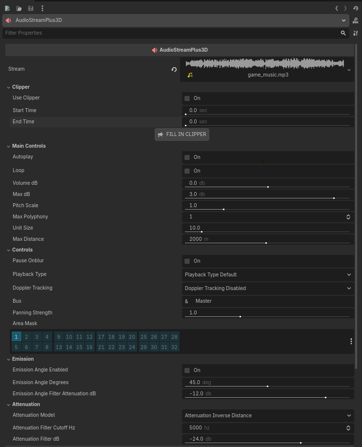

<h1 align="center"> Audio Stream Plus 3D </h1>

<div align="center">
  
</div>

### Audio Enhancement Node for Godot

**AudioStreamPlus3D** is a powerful extension of Godot's native AudioStreamPlayer3D node, designed to provide enhanced audio playback capabilities with advanced features such as clipper support, improved loop control, and much more. It maintains full compatibility with the Godot audio system, adding a rich set of customizable options.

---

## Overview

**AudioStreamPlus3D** enhances the standard AudioStreamPlayer3D with features such as:

### 1- Audio clipping support:

> In the Godot Engine inspector, choose the start and end times for playback.

### 2- Signal between loops:

> AudioStreamPlus3D outputs a signal between each loop when using audio clipping with loop enabled. Furthermore, it has been implemented to output signals from special Streams that Godot itself does not output, such as AudioStreamInteractive and others. Now with AudioStreamPlus3D, you will have these signals!

### 3- Pause signals:

> In the Godot Engine inspector, you can configure the audio to pause whenever the game window loses focus and resume playback when it regains focus. This also applies to web applications; in fact, if you are using looped audio clipping, we advise enabling this option due to web limitations.

---

## Installation

Place AudioStreamPlus3D in your project's addons/ directory.
Enable the plugin in **Project Settings** > **Plugins**.
Use it just like a regular AudioStreamPlayer3D node.

---

## Properties

| Property                               | Type                                 | Description                                                                                                                                                    |
| -------------------------------------- | ------------------------------------ | -------------------------------------------------------------------------------------------------------------------------------------------------------------- |
| `stream`                               | AudioStream                          | The audio stream to play. Setting this stops all currently playing sounds.                                                                                     |
| `use_clipper`                          | bool                                 | Enables or disables clipper functionality.                                                                                                                     |
| `start_time`                           | float                                | Start time in seconds when use_clipper is enabled.                                                                                                             |
| `end_time`                             | float                                | End time in seconds when use_clipper is enabled.                                                                                                               |
| `clipper_ignore_time_scale`            | bool                                 | Ignore time scaling for audio clipping.                                                                                                                        |
| `autoplay`                             | bool                                 | If true, automatically plays the stream when entering the tree.                                                                                                |
| `loop`                                 | bool                                 | Enables looping of the audio.                                                                                                                                  |
| `volume_db`                            | float                                | Volume in decibels.                                                                                                                                            |
| `max_db`                               | float                                | Sets the absolute maximum of the sound level, in decibels.                                                                                                     |
| `pitch_scale`                          | float                                | Pitch multiplier.                                                                                                                                              |
| `max_polyphony`                        | int                                  | Maximum number of sounds that can play simultaneously.                                                                                                         |
| `unit_size`                            | float                                | The factor for the attenuation effect. Higher values make the sound audible over a larger distance.                                                            |
| `max_distance`                         | float                                | Maximum distance from which audio is still hearable.                                                                                                           |
| `pause_onblur`                         | bool                                 | Pauses the audio when the game window or browser tab loses focus.                                                                                              |
| `playback_type`                        | AudioServer.PlaybackType             | Forces playback type.                                                                                                                                          |
| `doppler_tracking`                     | AudioStreamPlayer3D.DopplerTracking  | Decides in which step the Doppler effect should be calculated                                                                                                  |
| `bus`                                  | StringName                           | Audio bus to route the sound to.                                                                                                                               |
| `panning_strength`                     | float                                | Ajusta a intensidade da panorâmica.                                                                                                                            |
| `area_mask`                            | int                                  | Determines which Area2D layers affect the sound for reverb and audio bus effects.                                                                              |
| `emission_angle_enabled`               | bool                                 | If true, the audio should be attenuated according to the direction of the sound.                                                                               |
| `emission_angle_degrees`               | float                                | The angle in which the audio reaches a listener unattenuated.                                                                                                  |
| `emission_angle_filter_attenuation_db` | float                                | Attenuation factor used if listener is outside of emission_angle_degrees and emission_angle_enabled is set, in decibels.                                       |
| `attenuation_model`                    | AudioStreamPlayer3D.AttenuationModel | Decides if audio should get quieter with distance linearly, quadratically, logarithmically, or not be affected by distance, effectively disabling attenuation. |
| `attenuation_filter_cutoff_hz`         | int                                  | The cutoff frequency of the attenuation low-pass filter, in Hz.                                                                                                |
| `attenuation_filter_db`                | float                                | Amount how much the filter affects the loudness, in decibels.                                                                                                  |
| `is_playing`                           | bool                                 | Returns whether audio is currently playing or not.                                                                                                             |
| `is_paused`                            | bool                                 | Returns whether the audio is paused or not.                                                                                                                    |

---

## Methods

| Method                                         | Description                                       |
| ---------------------------------------------- | ------------------------------------------------- |
| `play(from_position: float = 0.0)`             | Starts playing the audio from a given position.   |
| `stop()`                                       | Stops the currently playing audio.                |
| `pause()`                                      | Pauses the audio playback.                        |
| `unpause()`                                    | Resumes paused audio.                             |
| `get_length()`                                 | Returns the total length of the audio stream.     |
| `get_length_with_weight()`                     | Returns the length adjusted for pitch or clipper. |
| `get_playback_position(add_mix: bool = false)` | Returns the current playback position.            |
| `get_stream_playback()`                        | Returns the current AudioStreamPlayback.          |
| `has_stream_playback()`                        | Returns true if audio is currently playing.       |
| `seek(to_position: float)`                     | Seeks to a specific position in the audio.        |
| `get_audio_stream_player()`                    | Returns the internal AudioStreamPlayer3D node.    |

---

## Signals

| Signal                             | Description                                                                          |
| ---------------------------------- | ------------------------------------------------------------------------------------ |
| `finished`                         | Emitted when a sound finishes playing. This only works for playback without looping. |
| `finished_loop_in_clipper`         | Emitted when a clipper loop finishes.                                                |
| `pause_unpause_focus(pause: bool)` | Emitted when audio is paused/unpaused due to focus loss.                             |

---

## Example Usage

Basic Setup:

```gdscript
# Create new AudioStreamPlus3D
var audio_plus = AudioStreamPlus3D.new()

# Add a stream
audio_plus.stream = preload("res://assets/audios/door.mp3")

# Add to the node tree
add_child(audio_plus)

# Play the audio
audio_plus.play()

```

Using Clipper:

```gdscript
# Enable the use of audio clipping.
audio_plus.use_clipper = true
audio_plus.start_time = 0.7
audio_plus.end_time = 1.2

```

Loop with Clipper:

```gdscript
# Enable the use of audio clipping.
audio_plus.use_clipper = true
audio_plus.start_time = 0.7
audio_plus.end_time = 1.2
audio_plus.loop = true


```

Connect to the loop signal:

```gdscript
# Create new AudioStreamPlus3D
var audio_plus = AudioStreamPlus3D.new()
audio_plus.stream = preload("res://assets/audios/door.mp3")
add_child(audio_plus)

# Enable the use of audio clipping.
audio_plus.use_clipper = true
audio_plus.start_time = 0.7
audio_plus.end_time = 1.2
audio_plus.loop = true

# Connect to the loop signal
audio_plus.finished_loop_in_clipper.connect(func():
    print("Loop...")
    )

# Play the audio
audio_plus.play()

```

---

## Configuration Warnings

AudioStreamPlus3D will show warnings in the editor when:

- No stream is assigned.
- start_time is greater than or equal to end_time.
- The bus is invalid or empty.
- Incompatible stream types are used with clipper or loop.

---

## Notes

> **AudioStreamInteractive** does not support pitch scaling or polyphony. This is already native to the Godot class.

> The looping behavior of **AudioStreamPlaylist** is overridden by this plugin's loop property. If you set loop to true in a playlist, it will loop.

> **Clipper** is not compatible with **AudioStreamInteractive**, **AudioStreamRandomizer**, **AudioStreamSynchronized**, and **AudioStreamPlaylist**.

---

## Screenshots


