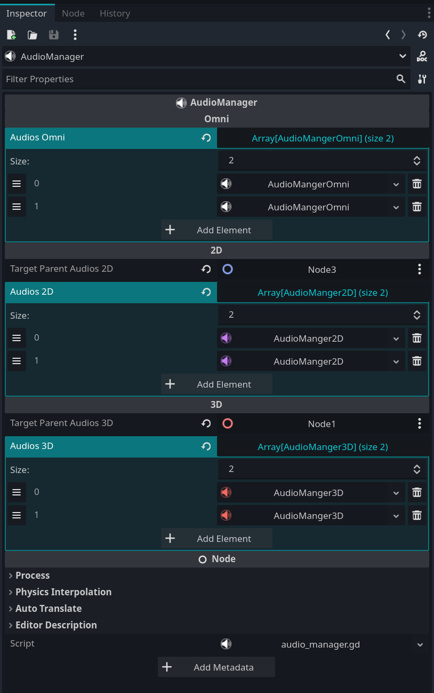

# AudioManager - Advanced Audio Management for Godot

**AudioManager** é um plugin poderoso para o Godot Engine que simplifica e aprimora o gerenciamento de áudio no seu jogo. Ele suporta áudios do tipo **Omni**, **2D** e **3D**, permitindo que você controle a reprodução, recorte, looping e várias propriedades de áudio a partir de um único nó. Com este plugin, você pode gerenciar facilmente várias faixas de áudio, aplicar efeitos como atenuação baseada em distância e controlar a reprodução programaticamente.

## Recursos

- **Controle Unificado de Áudio**: Gerencie áudios Omni, 2D e 3D a partir de um único nó.
- **Recorte de Áudio**: Defina tempos de início e fim personalizados para cada faixa de áudio.
- **Suporte a Looping**: Habilite looping para qualquer áudio, mesmo que o arquivo não tenha suporte nativo.
- **Offset de Loop**: Adicione um deslocamento para loops suaves em áudios não contínuos.
- **Controle de Reprodução**: Toque, pause, pare e retome áudios por nome ou em massa.
- **Áudio Baseado em Distância**: Aplique atenuação de volume com base na distância do ouvinte (para áudios 2D e 3D).
- **Propriedades Personalizáveis**: Ajuste volume, tom, distância máxima e mais para cada faixa de áudio.
- **Reprodução Automática**: Inicie a reprodução de áudio automaticamente ao carregar a cena.
- **Integração com o Editor**: Configure todas as opções diretamente no editor do Godot.

## Como Funciona

O **AudioManager** centraliza o gerenciamento de áudio no Godot, permitindo que você defina e controle múltiplas faixas de áudio (Omni, 2D e 3D) em um único nó. Ele usa tipos de recursos personalizados (`AudioMangerOmni`, `AudioManger2D`, `AudioManger3D`) para configurar as propriedades de cada faixa, como recorte, looping e configurações de reprodução. O plugin gerencia internamente a criação e o controle de reprodutores de áudio e temporizadores, fornecendo uma API simples para controlar a reprodução programaticamente.

## Instalação

1. Baixe os arquivos do plugin.
2. Extraia os arquivos para o diretório `res://addons/` no seu projeto Godot.
3. Ative o plugin no Godot acessando `Projeto > Configurações do Projeto > Plugins` e ativando o **AudioManager**.

## Uso

### Adicionando Faixas de Áudio

1. Adicione o nó **AudioManager** à sua cena.
2. No **Inspector**, configure as listas de áudio:
   - **Omni**: Para áudio global (ex.: música de fundo).
   - **2D**: Para áudio posicional em espaço 2D.
   - **3D**: Para áudio posicional em espaço 3D.
3. Para cada tipo de áudio, adicione entradas nas respectivas listas (`audios_omni`, `audios_2d`, `audios_3d`).
4. Configure cada entrada de áudio com propriedades como `audio_name`, `audio_stream`, `start_time`, `end_time`, `loop`, `auto_play`, etc.

### Controlando a Reprodução de Áudio

Você pode controlar a reprodução de áudio usando os seguintes métodos:

#### Áudio Omni
- **Tocar Áudio**: ```gdscript AudioManager.play_audio_omni("audio_name") ```
- **Pausar Áudio**: ```gdscript AudioManager.pause_audio_omni("audio_name") ```
- **Retomar Áudio**: ```gdscript AudioManager.continue_audio_omni("audio_name") ```
- **Parar Áudio**: ```gdscript AudioManager.stop_audio_omni("audio_name") ```

#### Áudio 2D
- **Tocar Áudio**: ```gdscript AudioManager.play_audio_2d("audio_name") ```
- **Pausar Áudio**: ```gdscript AudioManager.pause_audio_2d("audio_name") ```
- **Retomar Áudio**: ```gdscript AudioManager.continue_audio_2d("audio_name") ```
- **Parar Áudio**: ```gdscript AudioManager.stop_audio_2d("audio_name") ```

#### Áudio 3D
- **Tocar Áudio**: ```gdscript AudioManager.play_audio_3d("audio_name") ```
- **Pausar Áudio**: ```gdscript AudioManager.pause_audio_3d("audio_name") ```
- **Retomar Áudio**: ```gdscript AudioManager.continue_audio_3d("audio_name") ```
- **Parar Áudio**: ```gdscript AudioManager.stop_audio_3d("audio_name") ```

### Controle em Massa

Você também pode controlar todas as faixas de áudio de um tipo específico ou todos os tipos de uma vez:

- **Tocar Todos os Áudios**: ```gdscript AudioManager.play_all() ``` # Toca todos os áudios Omni, 2D e 3D  
  ```gdscript AudioManager.play_all_omni() ``` # Toca todos os áudios Omni  
  ```gdscript AudioManager.play_all_2d() ``` # Toca todos os áudios 2D  
  ```gdscript AudioManager.play_all_3d() ``` # Toca todos os áudios 3D  
- **Parar Todos os Áudios**: ```gdscript AudioManager.stop_all() ``` # Para todos os áudios Omni, 2D e 3D  
  ```gdscript AudioManager.stop_all_omni() ``` # Para todos os áudios Omni  
  ```gdscript AudioManager.stop_all_2d() ``` # Para todos os áudios 2D  
  ```gdscript AudioManager.stop_all_3d() ``` # Para todos os áudios 3D  
- **Pausar Todos os Áudios**: ```gdscript AudioManager.pause_all() ``` # Pausa todos os áudios Omni, 2D e 3D  
  ```gdscript AudioManager.pause_all_omni() ``` # Pausa todos os áudios Omni  
  ```gdscript AudioManager.pause_all_2d() ``` # Pausa todos os áudios 2D  
  ```gdscript AudioManager.pause_all_3d() ``` # Pausa todos os áudios 3D  
- **Retomar Todos os Áudios**: ```gdscript AudioManager.continue_all() ``` # Retoma todos os áudios pausados Omni, 2D e 3D  
  ```gdscript AudioManager.continue_all_omni() ``` # Retoma todos os áudios pausados Omni  
  ```gdscript AudioManager.continue_all_2d() ``` # Retoma todos os áudios pausados 2D  
  ```gdscript AudioManager.continue_all_3d() ``` # Retoma todos os áudios pausados 3D  

### Recuperando Recursos de Áudio

Você pode acessar os recursos de áudio diretamente para modificar suas propriedades em tempo de execução:
- **Obter Recurso de Áudio**: 

    ```v 
        var audio_omni = $audio_manager.get_audio_omni("audio_name") 
    ```  
    ```v 
        var audio_2d = $audio_manager.get_audio_2d("audio_name") 
    ```  
    ```v 
        var audio_3d = $audio_manager.get_audio_3d("audio_name") 
    ```

## Configuração

Cada faixa de áudio pode ser configurada com as seguintes propriedades:
- **Nome do Áudio**: Um identificador único para a faixa de áudio.
- **Fluxo de Áudio**: O arquivo de áudio a ser reproduzido.
- **Tempo de Início**: O tempo (em segundos) para começar a tocar o áudio.
- **Tempo de Fim**: O tempo (em segundos) para parar o áudio.
- **Usar Clipper**: Se deve usar recorte (tempos de início e fim).
- **Loop**: Habilita looping para o áudio.
- **Reprodução Automática**: Toca o áudio automaticamente ao carregar a cena.
- **Volume DB**: O nível de volume em decibéis.
- **Escala de Tom**: O ajuste de tom.
- **Distância Máxima** (2D e 3D): A distância máxima para atenuação de áudio.
- **Polifonia Máxima**: O número máximo de fluxos simultâneos.
- **Força de Panning** (2D e 3D): A intensidade do efeito de panning.

Essas propriedades podem ser definidas diretamente no editor do Godot via o **Inspector** ao selecionar uma entrada de áudio no nó **AudioManager**.

### Configuração de Áudio Posicional (2D e 3D)

As propriedades `target_parent_audios_2d` e `target_parent_audios_3d` definem o nó pai onde os reprodutores de áudio 2D e 3D serão instanciados, permitindo que os áudios tenham posições específicas nas cenas 2D ou 3D. Isso é essencial para efeitos como atenuação de volume baseada em distância, panning (em 2D) e áudio espacial (em 3D):
- **`target_parent_audios_2d`**: Define o nó pai (do tipo `Node2D`) para os áudios 2D. Vincule-o a um nó com posição na cena 2D (ex.: um personagem) para que efeitos posicionais, como variação de volume e panning, funcionem corretamente com base na distância e localização do ouvinte.
- **`target_parent_audios_3d`**: Define o nó pai (do tipo `Node3D`) para os áudios 3D. Vincule-o a um nó com posição no espaço 3D (ex.: um objeto ou inimigo) para habilitar efeitos de áudio espacial, como atenuação de volume, direção do som e Doppler, dependendo da posição relativa ao ouvinte.

#### Atenção: Necessidade de um Ouvinte de Áudio
Para que o som seja ouvido e os efeitos posicionais funcionem, **é obrigatório** ter um ouvinte de áudio configurado na cena:
- Para áudio **2D**: Adicione um nó `AudioListener2D` ou configure uma câmera 2D como ouvinte (propriedade `current` ativada).
- Para áudio **3D**: Adicione um nó `AudioListener3D` ou configure uma câmera 3D como ouvinte (propriedade `current` ativada).
**Alerta**: Sem um ouvinte (`AudioListener2D` ou `AudioListener3D`) ou uma câmera configurada, o áudio não será reproduzido corretamente, e os efeitos de distância e posição não funcionarão.

## Exemplos

### Exemplo 1: Tocando Música de Fundo (Áudio Omni)
1. Adicione um nó **AudioManager** à sua cena.
2. No **Inspector**, em **Omni**, adicione uma nova entrada de áudio.
3. Defina **Nome do Áudio** como `"background_music"`.
4. Atribua um arquivo de áudio ao **Fluxo de Áudio**.
5. Defina **Reprodução Automática** como `true` para iniciar a reprodução ao carregar a cena.

Alternativamente, toque programaticamente: ```gdscript AudioManager.play_audio_omni("background_music") ```

### Exemplo 2: Tocando um Efeito Sonoro em Espaço 3D
1. Adicione um nó **AudioManager** à sua cena.
2. Defina **Target Parent Audios 3D** para o nó de origem do áudio (ex.: um personagem ou objeto).
3. No **Inspector**, em **3D**, adicione uma nova entrada de áudio.
4. Defina **Nome do Áudio** como `"explosion"`.
5. Atribua um arquivo de áudio ao **Fluxo de Áudio**.
6. Configure **Distância Máxima** para controlar até onde o som pode ser ouvido.

Toque o som quando necessário: 
```v 
$audio_manager.play_audio_3d("explosion") 
```

### Exemplo 3: Fazendo Loop em um Clipe de Áudio Recortado
1. Adicione um nó **AudioManager** à sua cena.
2. No **Inspector**, em **Omni**, adicione uma nova entrada de áudio.
3. Defina **Nome do Áudio** como `"looped_clip"`.
4. Atribua um arquivo de áudio ao **Fluxo de Áudio**.
5. Defina **Usar Clipper** como `true`.
6. Defina **Tempo de Início** como `2.0` segundos e **Tempo de Fim** como `10.0` segundos.
7. Defina **Loop** como `true`.

Isso tocará o áudio de 2 a 10 segundos e o repetirá continuamente.

## Capturas de Tela




## Licença

Este plugin está disponível sob a [Licença MIT](LICENSE.md).

## Contato

Para suporte ou feedback, entre em contato com [seu-email@example.com].